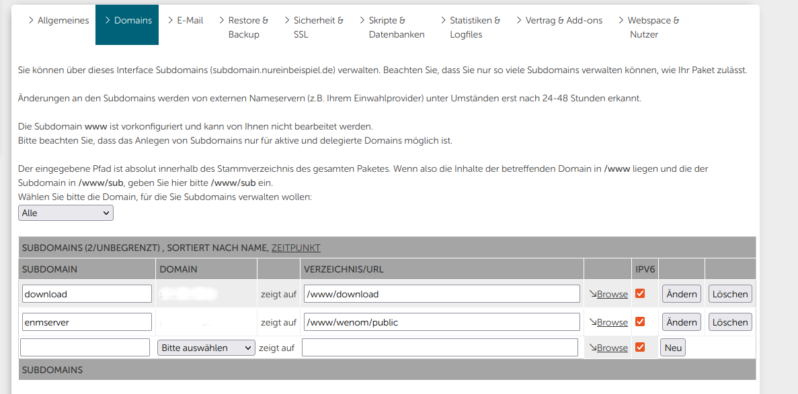
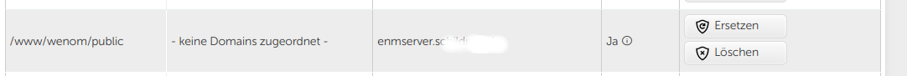
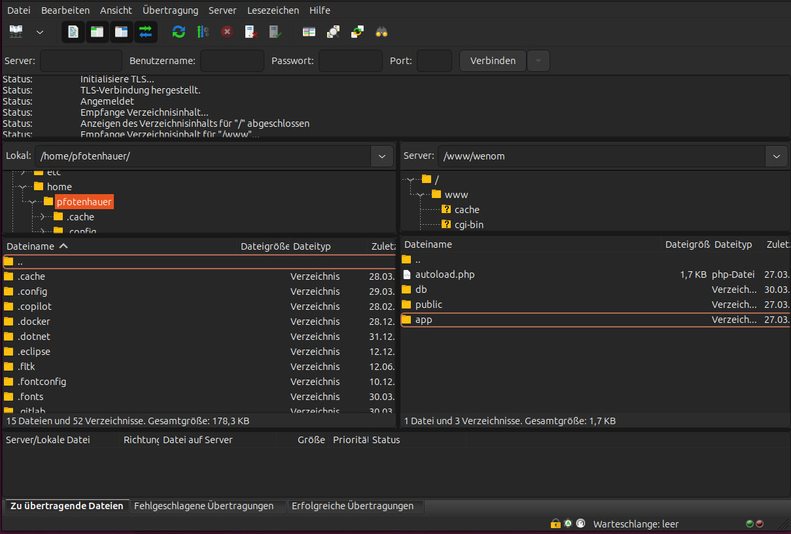
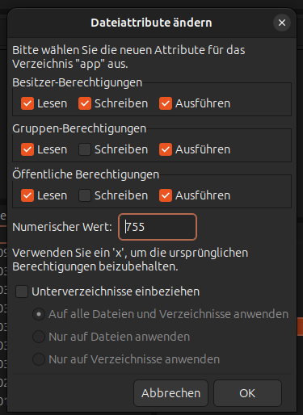
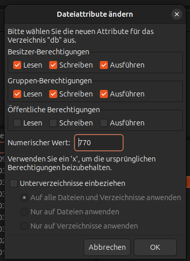

# Webspace Hosteurope

## Voraussetzung

+ Sie haben einen Webspace bei Hosteurope
+ Sie haben einen FTP-Zugang zum Dateisystem des Webhostings
+ Sie benötigen eine Subdomain
+ Sie benötigen ein Zertifikat

## Subdomain anlegen

Loggen Sie sich in den Kundenbrereich (KIS) von Hosteurope ein.
Legen Sie unter "Domains" eine Subdomain an.

Verknüpfen Sie diese Subdomain mit einem SSL-Zertifikat für die sichere Verbindung.

## FTP Verbindung aufbauen und Dateien hochladen

Verbinden Sie sich mit Ihrem FTP-User und laden Sie die Dateien aus dem ZIP in das Verzeichnis, das mit der gewünschten Subdomain verknüpft wurde.

Setzen Sie die Rechte (auf alle Unterordner und Dateien) auf die Ordner Public und App:

Setzen Sie die Rechte  (auf alle Unterordner und Dateien) auf den Ordner db:

