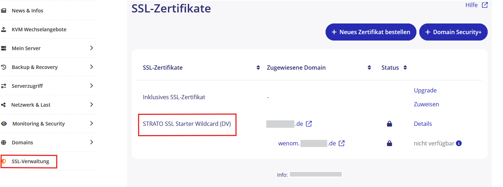

# Strato-Server

## Voraussetzung

+ Sie haben einen virtuellen Linux-Server bei Strato
+ Sie haben einen FTP-Zugang zum Dateisystem des Webhostings
+ Sie benötigen eine Subdomain
+ Sie benötigen ein Zertifikat

## Subdomain anlegen (optional)

Falls Sie ihren Wenom Server unter einer Subdomain betreiben wollen, wie zum Beispiel wenom.IhreWebseite.de, muss diese noch angelegt weden. Loggen Sie sich dazu in den Kundenbereich - Server-Login bei Strato ein.
Legen Sie unter "Domains" eine Subdomain an.

Verknüpfen Sie diese Subdomain mit einem SSL-Zertifikat für die sichere Verbindung.  

Setzen Sie das Zielverzeichnis.  

## FTP Verbindung aufbauen, Dateien hochladen und entpacken

Verbinden Sie sich mit Ihrem FTP-Benutzer und laden Sie die ZIP-Datei in das Verzeichnis, das mit der gewünschten Subdomain verknüpft wurde. Entpacken Sie die ZIP-Datei

>Bemerkung: Diese Prozesse können auch mit Anwendungen wie z.B. **FileZilla** erledigt werden.

  

## Berechtigungen von Ordnern ändern
Setzen Sie die Rechte (auf alle Unterordner und Dateien) auf die Ordner `Public` und `App`:

## Einrichtung 

Weiter geht es mit der [Ersteinrichtung](../installation/ersteinrichtung.md) des WebNotenManagers.
