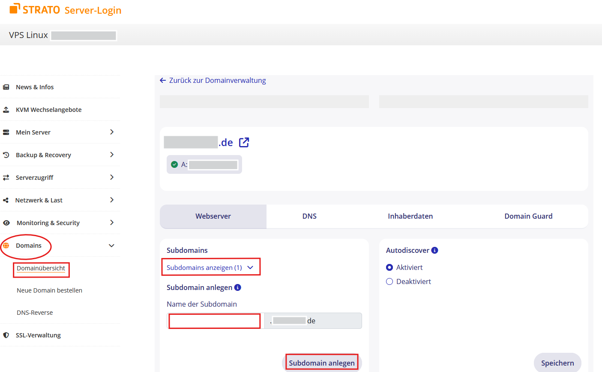
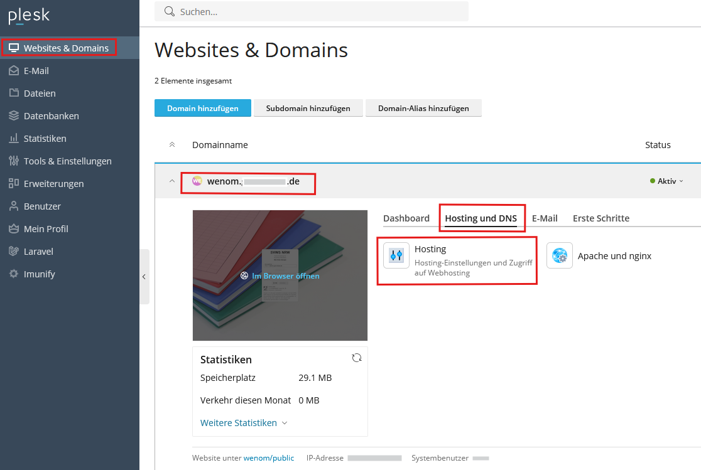
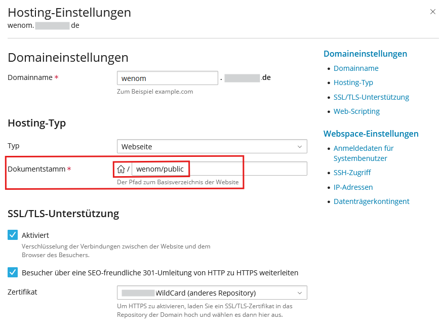
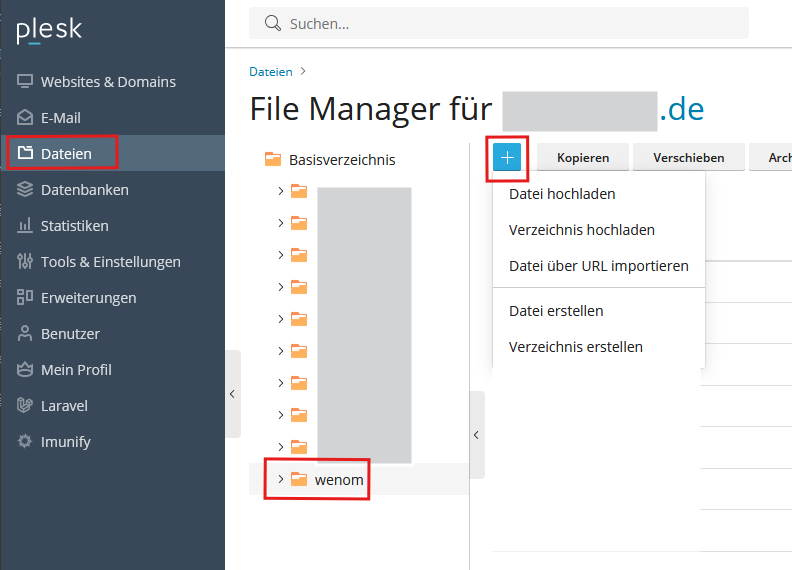
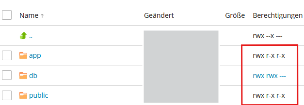

# Strato-Server (Linux, virtuell)

## Voraussetzung

+ Sie haben einen virtuellen Linux-Server bei Strato

+ Sie haben einen FTP-Zugang zum Dateisystem des Webhostings

+ Sie benötigen eine Subdomain

+ Sie benötigen ein Zertifikat

## Subdomain anlegen

Loggen Sie sich in den Kundenbrereich - Server-Login bei Strato ein.
Legen Sie unter "Domains" eine Subdomain an.

Wechseln Sie in das Dashbord Plesk von Strato zur Adminstrierung des virtuellen Servers.

Verknüpfen Sie diese Subdomain mit einem SSL-Zertifikat für die sichere Verbindung.  

Setzen Sie das Zielverzeichnis.  

## FTP Verbindung aufbauen, Dateien hochladen und entpacken

Verbinden Sie sich mit Ihrem FTP-User und laden Sie die ZIP-Datei in das Verzeichnis, das mit der gewünschten Subdomain verknüpft wurde. Entpacken Sie die ZIP-Datei

>Bemerkung: Diese Prozesse können auch mit Anwenungen wie z.B. **FileZilla** erledigt werden.

  

## Berchtigungen von Ordnern ändern
Setzen Sie die Rechte (auf alle Unterordner und Dateien) auf die Ordner Public und App:

