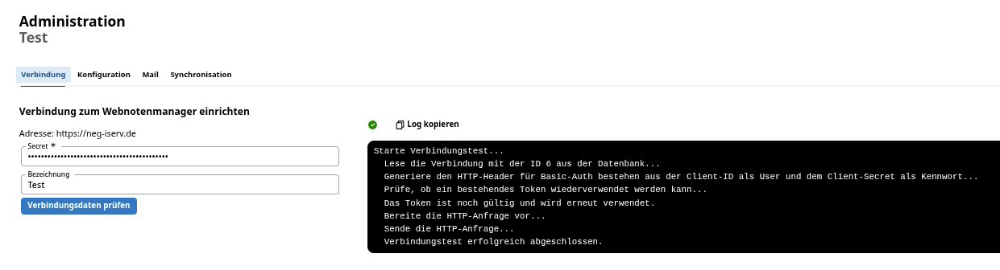

# Ersteinrichtung WeNoM

Die Einrichtung der Synchronisation mit dem SVWS-Server obliegt der für die Schule zuständigen **schulfachlichen Administration**, gegebenfalls also der Schulleitung, Stellvertretung oder Beauftragte/technische Koordinatoren/Schuladmins. Es werden somit höhere Rechte beim Benutzer des SVWS-Servers benötigt. 
Zur Einrichtung eines neuen WebNotenManagers im SVWS-Server das Pluszeichen unter **Noten -> Administration -> Serververbindungen -> Server** drücken.


(Es können mit einer Datenbank mehrer Webnotenmanager verknüpft werden, um z.B. in größeren Berufskollegs die Abteilungen autark voneinander arbeiten zu lassen.)

## Generierung des Secrets

Damit der SVWS-Server und WeNoM gesichert kommunizieren können, wird ein *Secret* benötigt. Dies wird im OAuth2-Verfahren verwendet, um die sendende Gegenstelle zu identifizieren.

Das Secret wird bei der erstmaligen Eingabe der Verbindungsdaten im SVWS-Webclient automatisch generiert und im Webspace des WeNoM unter `./db/client.sec` abgespeichert. Das Secret aus dieser Datei muss unter *Secret* (vgl. Screenshot) eingefügt werden.


Alternativ können Sie das Secret auch direkt **ohne SVWS-Server** per [API Aufruf](#alternativ-generation-des-secrets-durch-einen-direkten-api-aufruf) generieren.

Ist das Secret erfolgreich eingtragen, kann jederzeit die Verbindung zum WeNoM geprüft werden:




## Synchronisation und Konfiguration des WeNoM

Nach der Ersteinrichtung befinden sich noch keine Daten, also explizit auch keine Logindaten auf dem WeNoM. Dazu benötigt es einer Synchronisation bzw. ein Hochladen der Daten. Dies kann im Benutzerhandbuch [schulische Administration](../benutzerhandbuch/schulische_administration.md) nachgelesen werden.


## Fehler bei der Einrichtung

### Fehlerhafte Eingabe der URL 

die richtige Syntax ist hier die Eingabe von Beispielsweise `meinWeNoM.de`, ohne `https`://` und Backslash. Eine sicher Verbindung zu einem HTTPS-gesicherten Server ist auf jeden Fall Voraussetzung. Eine Verbindung zu einem HTTP-Server ist nicht zulässig.

+ Prüfen Sie, ob Sie ggf Dopplungen haben: `https://https//meinWeNoM.de`.
+ Prüfen Sie auf Sonderzeichen, die sich eingeschlichen haben können: `https://mein%WeNoM.de`.
+ Prüfen Sie, ob Sie ein Backslash zu viel am Ende haben: `https://meinWeNoM.de/`.

### Abweichungen des internen Names

Möglicherweise ist die URL vom SVWS-Server aus nicht auffindbar. Dies könnte an den Einstellungen eines Proxyservers liegen.

Hier könnte eine direkte Angabe der IP-Adresse statt des DNS-Namens erfolgen.

### Benutzung eines internen Zertifikats

In manchen netzinternen Umgebungen kann die Frage auftreten, ob dem eigenen Zertifikat vertraut werden soll. Dies kann in Absprache mit dem technischen Admin durch Setzen des Hakens bestätigt werden.

## Alternativ: Generation des Secrets per API

Wennn Sie ohne einen SVWS-Server das Secret generieren möchten und dieses dann an die schulische Administration übergeben wollen, können Sie dies per Api-Aufruf auslösen: 

Hinweis: Über die Konsole des Browsers (F12) kann die Serverantwort überprüft werden. Darüber hinaus gibt es kein sichtbares Feedback.

Zur Initialisierung wird folgende URL */api/setup* auf ihrer Domain aufrufen, ein Beispiel wäre etwa:

```
    https://meinnotenmanager.de/api/setup
```

Dies kann von jedem gängigen Browser aus ausgefürt werden.

Gültige Responsecodes sind:

```
    204 Setup erfolgreich
    409 Server ist schon initialisier
```

Der Aufruf des oben genannten Api-Befehls erzeugt im Ordner */db* eine *app.sqlite*-Datenbank und eine Datei `client.sec`.

In dieser Datei steht das generierte *Secret*.
