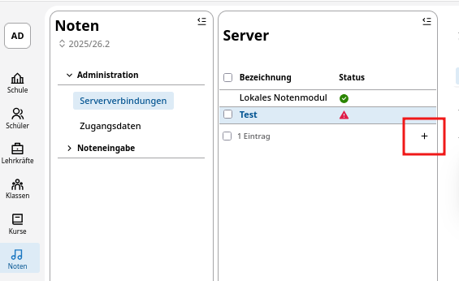
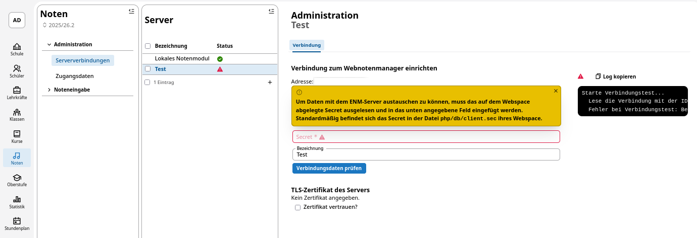
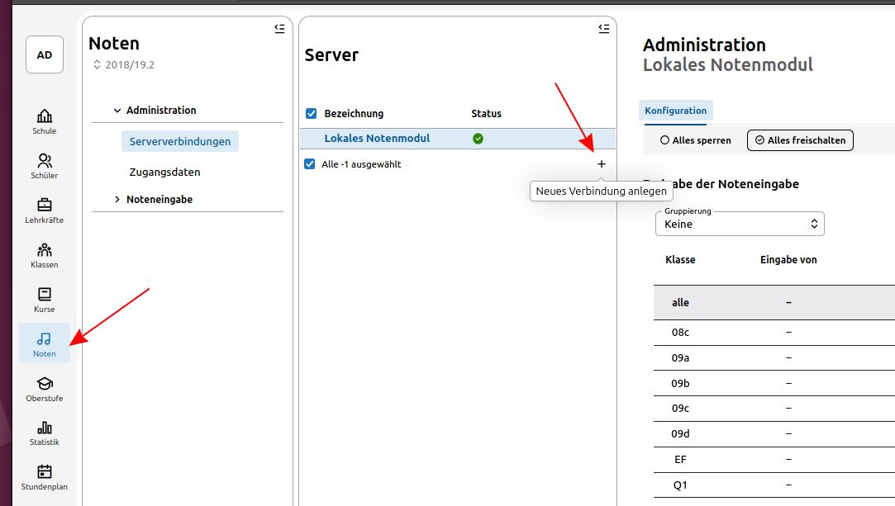
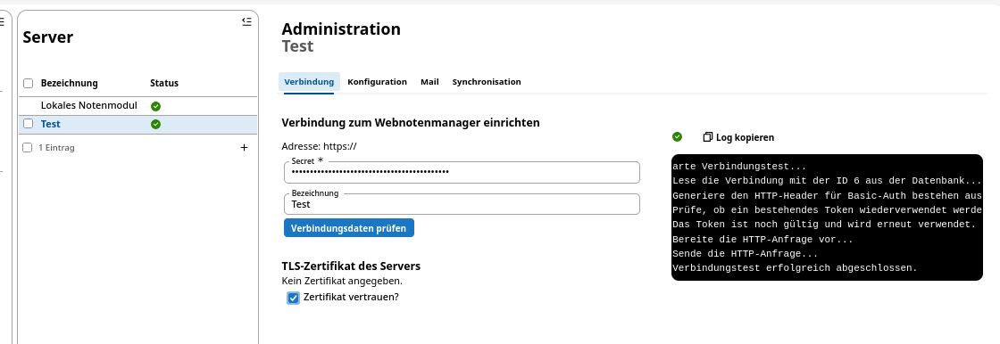
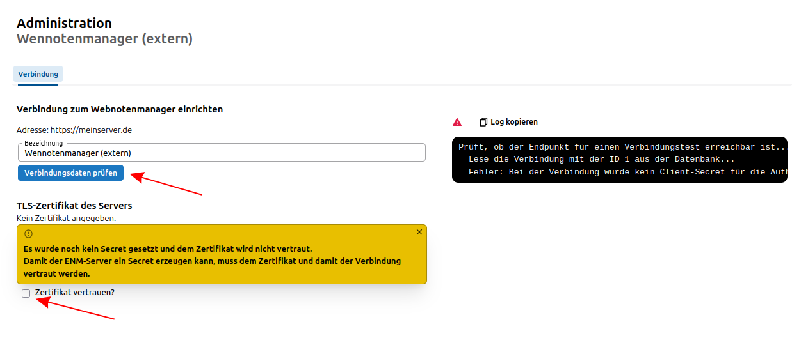

# Technische Ersteinrichtung WeNoM

Zur Einrichtung eines neuen WebNotenManagers im SVWS-Server das Pluszeichen unter Noten -> Administration -> Serververbindungen -> Server drücken.



(Es können mit einer Datenbank mehrer Webnotenmanager verknüpft werden, um z.B. in größeren Berufskollegs die Abteilungen autark voneinander arbeiten zu lassen.)

## Generierung des Secrets

Damit der SVWS-Server und WeNoM gesichert kommunizieren können, wird ein *Secret* benötigt. Dies wird im OAuth2-Verfahren verwendeten, um die sendende Gegenstelle zu identifizieren.

Das Secret wird bei der erstmaligen Eingabe der Verbindungsdaten im SVWS-Webclient automatisch generiert und im Webspace des WeNoM unter ```./db/client.sec``` abgespeichert. Das Secret aus dieser Datei muss wie hier im Screeshot dargestellt eingefügt werden. 



Alternativ können Sie das Secret auch direkt per [API Aufruf](#generation-des-secrets-durch-einen-direkten-api-aufruf) generieren.

### Alternativ: Generation des Secrets durch einen direkten API-Aufruf

Zur ersten Initialisierung folgende URL */api/setup* auf ihrer Domain aufrufen, ein Beispiel wäre etwa: 

    https://meinnotenmanager.de/api/setup

Über die Konsole des Browsers (F12) kann die Response überprüft werden.

Gültige Responsecodes sind:

    204 Setup erfolgreich
    409 Server ist schon initialisiert

Der Aufruf des oben genannten api-Befehls erzeugt im Ordner */db* eine *app.sqlite*-Datenbank und eine Datei `client.sec`.

In dieser Datei steht das generierte *Secret*.


## Einrichtung der Synchronisation mit dem SVWS-Server

Die Einrichtung der Synchronisation mit dem SVWS-Server obliegt der für die Schule zuständigen **schulfachlichen Administration**, gegebenfalls also der Schulleitung, Stellvertretung oder Beauftragte/technische Koordinatoren/Schuladmins. Es werden somit höhere Rechte beim Benutzer des SVWS-Servers benötigt. Das oben genannte *Secret* und die URL des WeNoM liegen dem schulfachlichen Administration vor bzw. werden dieser übermittelt.

Die Konfigurationsoberfläche für den WebNotenmanager befindet sich im Webclient des SVWS-Servers in der App **Noten ➜ Serververbindungen ➜ Verbindung**. 

 Hier werden das der schulfachlichen Administration vorliegende Secret und die URL eingetragen. Bitte hierbei auf die Schreibweise achten. Beispiel:
 
    https://wenom.ihre-domain.de



Nachdem die Verbindungsdaten erfolgreich eingegeben wurden, wird ein automatischer Verbindungstest durchgeführt und es erscheint bei erfolgreicher Testung ein grüner Hacken. 



## Fehler bei der Einrichtung 

### Abweichungen des internen Names

Möglicherweise ist die URL vom SVWS-Server aus nicht auffindbar. Dies könnte an den Einstellungen eines Proxyservers liegen.

Hier könnte eine direkte Angabe der IP-Adresse statt des DNS-Namens erfolgen oder es könnte die Eingabe von `http://` statt `https://` ausprobiert werden. 

### Benutzung eines internen Zertifikats

In manchen seltenen netzinternen Umgebungen kann die Frage auftreten, ob dem eigenen Zertifikat vertraut werden soll. Dies kann in Absprache mit dem technischen Admin durch Setzen des Hakens bestätigt werden. 

### Verbindung prüfen 

Sind die Zugangsdaten eingerichtet, kann die Verbindung jederzeit unter „Verbindungsdaten einrichten” geprüft werden. 



Fahren Sie nun mit der **Synchronisation** fort, die im Benutzerhandbuch für die [schulfachliche Administration](../benutzerhandbuch/schulische_administration.md) beschrieben ist.
