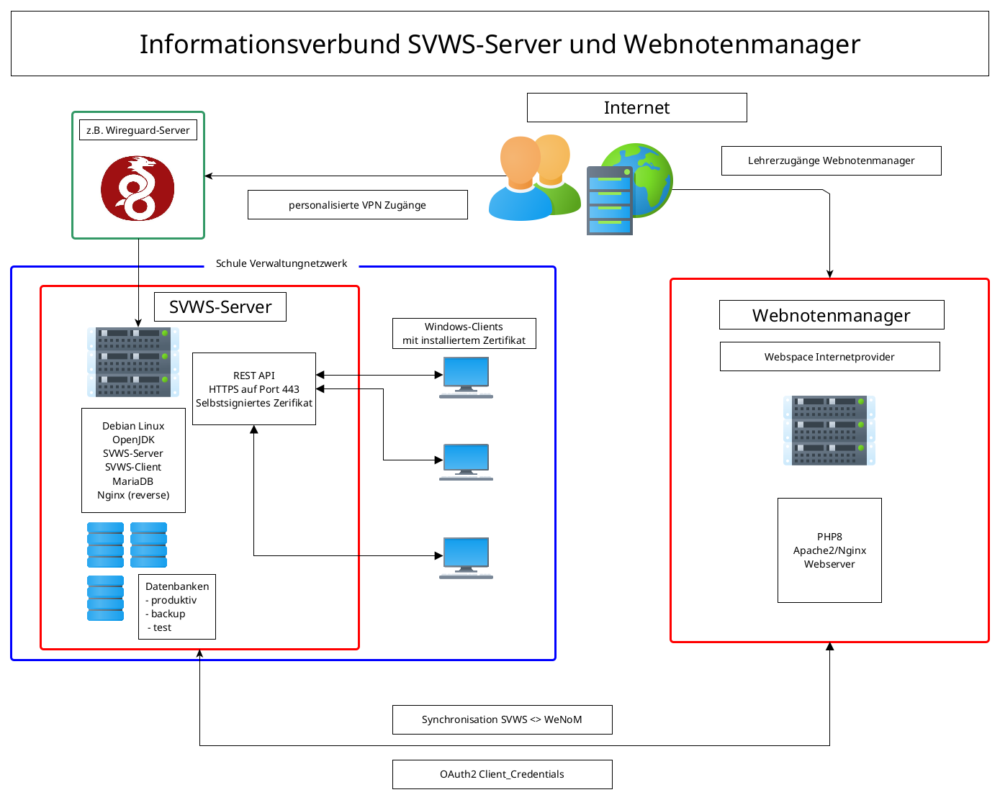

# Technische Übersicht zu WeNoM 

Zur Verwendung von WeNoM nutzen Sie das links im Inhaltsverzeichnis angeführte Benutzerhandhbuch.

Der WeNoM wird auf PHP Basis mit Typescript und VUE.js entwickelt und stellt eine benutzerfreundliche und intuitive Benutzeroberfläche bereit, um die Dateneingabe so einfach wie möglich zu gestalten.

Die Software synchronisiert die eingegebenen Daten teilautomatisch mit dem SVWS-Server, um sicherzustellen, dass die Daten stets auf dem neuesten Stand sind und für interne Schulzwecke zur Verfügung stehen.

