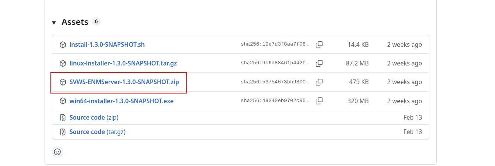
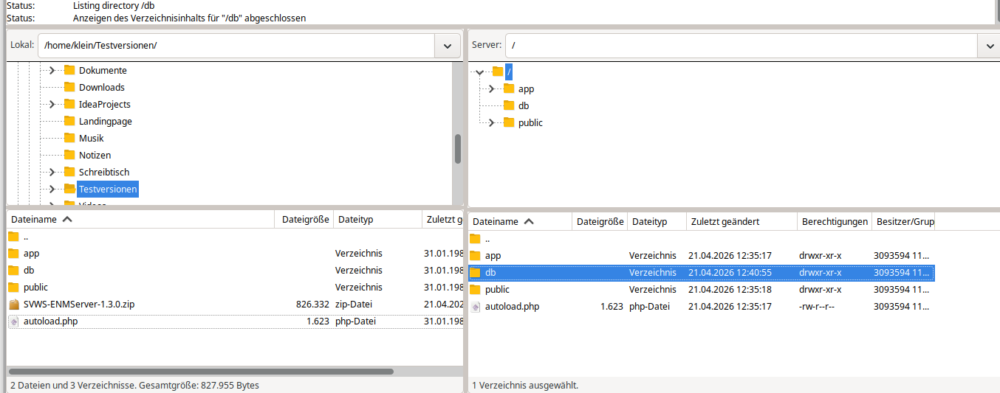

# WeNoM - Installationsanleitung

## Technische Übersicht zum WeNoM


Der WeNoM wird auf PHP-Basis mit TypeScript und vue entwickelt und stellt eine benutzerfreundliche und intuitive Benutzeroberfläche bereit, um die Dateneingabe so einfach wie möglich zu gestalten.

Die Software synchronisiert die eingegebenen Daten teilautomatisch mit dem SVWS-Server, um sicherzustellen, dass die Daten stets auf dem neuesten Stand sind und für interne Schulzwecke zur Verfügung stehen.

## Voraussetzungen

Es wird ein Webspace mit php8.2 oder höher, inkl. sqlite3 Modul benötigt. Der Webspace muss über ein Zertifikat verfügen (http**s**\://...).

Dies alles liegt in der Regel bei den gängigen [Webhostern](../hoster_installation/index.md) fertig eingerichtet vor.

Alternativ können Sie die Einrichtung des Webservers unter der Artikel "[eigener  Webserver](./installation_webserver.md)" nachlesen.


## Download der WeNoM Programmdateien

Unter [github.com/SVWS-NRW/SVWS-Server/releases](https://github.com/SVWS-NRW/SVWS-Server/releases) können neben dem SVWS-Server auch die Programmdateien des  zugehörigen WeNoM heruntergeladen werden: Dazu auf **SVWS-ENMServer-x.x.x.zip** klicken.



## Kopieren der WeNoM Programmdateien

+ Entpacken aller Dateinen aus der in das `/html` Verzeichnis des Webservers
+ Freigabe der Ordner `app`, `db` und `public` mit entsprechenden Rechten
+ Ändern des `DocumentRoot` im Apache in `/var/www/html/public` (siehe unten)




Die Ordnerstruktur in `/var/www/html/wenom` sollte nun folgerndermaßen aussehen:

```bash
/app
/db
/public
```

::: warning Wichtig!
`DocumentRoot` in der Apache-Konfiguration muss auf den Ordner `./public` zeigen!
:::

Die Änderung des `DocumentRoot` kann unter den hosterspezifischen Installationen oder der Installation für den eignenen Webserver bei Bedarf nachgelesen werden.


### Ordner-, Unterordner- und Dateiberechtigungen

1. Setzen Sie die korrekten Ordner-Berechtigungen (und Unterordner und Dateien) für `public`und `app`zum Lesen und Schreiben:
    - **Besitzer**: `Lesen, Schreiben, Ausführen`
    - **Gruppe**:  `Lesen, x, Ausführen`
    - **Öffentlich**: *NICHTS erlaubt*
    - Numerisch: `750`

2. Setzen Sie die Ordner-Berechtigungen für den Ordner `db` (und Unterordner und Dateien) auf
    - **Besitzer**: `Lesen, Schreiben, Ausführen`
    - **Gruppe**: `Lesen, Schreiben, Ausführen`
    - **Öffentlich**: *NICHTS erlaubt*
    - Numerisch: `770`

::: warning Kontrollieren Sie die Ordnerberechtigungen
Kontrollieren Sie bitte diese Berechtigungen gewissenhaft!
:::
