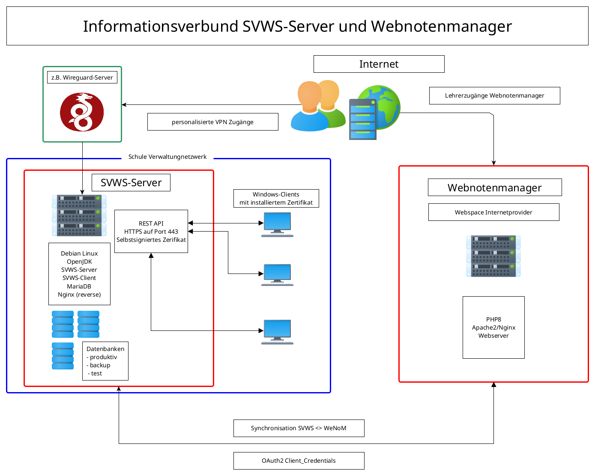
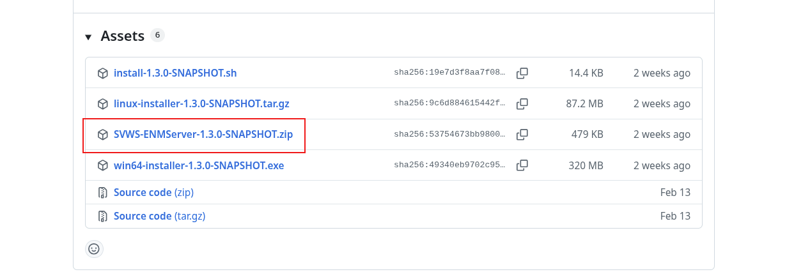

# SVWS-WeNoM - Installationsanleitung

## Technische Übersicht



Der SVWS-WeNoM wird auf PHP-Basis mit TypeScript und vue entwickelt und stellt eine benutzerfreundliche und intuitive Benutzeroberfläche bereit, um die Dateneingabe so einfach wie möglich zu gestalten.

Die Software synchronisiert die eingegebenen Daten teilautomatisch mit dem SVWS-Server, um sicherzustellen, dass die Daten stets auf dem neuesten Stand sind und für interne Schulzwecke zur Verfügung stehen.

## Voraussetzungen

Es wird ein Webspace mit mindestens php8.2 oder höher, inkl. sqlite3 Modul benötigt. Der Webspace muss über ein Zertifikat verfügen (http**s**\://...).

Dies alles liegt in der Regel bei den gängigen [Webhostern](../hoster_installation/index.md) fertig eingerichtet vor.

Alternativ können Sie die Einrichtung des Webservers unter der Artikel "[eigener  Webserver](./installation_webserver.md)" nachlesen.

Der SVWS-WeNoM ist über eine **eigene (Sub-)Domain** aufzurufen. Richten Sie sich hierfür zum Beispiel *wenom.MeineDomain.de*, *noten.MeineSchule.de* ein.

## Download der SVWS-WeNoM Programmdateien

Unter [github.com/SVWS-NRW/SVWS-Server/releases](https://github.com/SVWS-NRW/SVWS-Server/releases) können neben dem SVWS-Server auch die Programmdateien des  zugehörigen SVWS-WeNoM heruntergeladen werden: Dazu auf **SVWS-ENMServer-x.x.x.zip** klicken.



## Kopieren der SVWS-WeNoM Programmdateien

+ Entpacken aller Dateinen aus der in das `/html` Verzeichnis des Webservers
+ Freigabe der Ordner `app`, `db` und `public` mit entsprechenden Rechten
+ Stellen Sie die (Sub-)Domain so ein, dass sie auf das Verzeichnis ./public zeigt.  
Nutzen Sie dazu ggf. die Anleitung Ihres Hosters oder die Anleitung für einen eigenen Webserver.


Die Ordnerstruktur in `/var/www/html/wenom` sollte nun folgerndermaßen aussehen:

```bash
/app
/db
/public
```

::: warning Wichtig!
`DocumentRoot` in der Apache-Konfiguration muss auf den Ordner `./public` zeigen!
:::

Die Änderung des `DocumentRoot` kann unter den hosterspezifischen Installationen oder der Installation für den eignenen Webserver bei Bedarf nachgelesen werden.


### Ordner-, Unterordner- und Dateiberechtigungen

1. Setzen Sie die korrekten Ordner-Berechtigungen (und Unterordner und Dateien) für `public`und `app`zum Lesen und Schreiben:
    - **Besitzer**: `Lesen, Schreiben, Ausführen`
    - **Gruppe**:  `Lesen, x, Ausführen`
    - **Öffentlich**: *NICHTS erlaubt*
    - Numerisch: `750`

2. Setzen Sie die Ordner-Berechtigungen für den Ordner `db` (und Unterordner und Dateien) auf
    - **Besitzer**: `Lesen, Schreiben, Ausführen`
    - **Gruppe**: `Lesen, Schreiben, Ausführen`
    - **Öffentlich**: *NICHTS erlaubt*
    - Numerisch: `770`

::: warning Kontrollieren Sie die Ordnerberechtigungen
Kontrollieren Sie bitte diese Berechtigungen gewissenhaft!
:::

## Test

Sie 

## Impressum und Datenschutzhinweis

Für SVWS-WeNoM-Instanzen, die über das freie Internet erreichbar sind, ist ein Impressum zu setzen.

Erzeugen Sie im Pfad der Datenbank eine Datei *Impressum.md*, in die Sie Ihre Daten eintragen. 

Sie können den Standard-Datenschutzhinweis in SVWS-WeNoM ändern, indem Sie auch eine *Datenschutz.md* erzeugen und eigene Eintragungen vornehmen.

Wenn an den Pfaden nichts verändert wurde, ist der Standardpfad `wenom_verzeichnis/db/` für die beiden Dateien. Nutzen Sie andere Pfade, etwa für mehrere SVWS-WeNoM-Instanzen, müssen diese verwenden.

```
$impressumPath = $dbPath.'/Impressum.md';
$datenschutzPath = $dbPath.'/Datenschutz.md';
```

>[!TIP]Großschreibung
>Beachten Sie bitte die großen "I" und "D".

Liegt eine der beiden Dateien nicht vor, wird für die Nutzer bei `Impressum` der Link inaktiv und bei `Datenschutz` der Standardtext angezeigt.