# WeNoM Benutzerhandbuch

## Ersteinrichtung

Damit sich eine Lehrkraft anmelden kann, muss zuerst eine Synchronisation mit dem SVWS-Server eingerichtet werden. Erst dann werden die WeNoM-Daten, wie beispielsweise die persönlichen Lehrkraftzugänge, die Möglichkeit, E-Mails zu senden, oder die Klassen- und Kurslisten für die Notenerfassung, befüllt. Für die Einrichtung der Synchronisation wird ein sogenanntes Secret benötigt, das bei der Ersteinrichtung erzeugt wird. Dies ist Aufgabe der für die Schule zuständigen technischen Administration.

Die Einrichtung der Synchronisation wird in der [Installationsanleitung und technischen Dokumentation](wenom_installation.md) beschrieben. 

## Einrichtung der Synchronisation

Die Einrichtung der Synchronisation mit dem SVWS-Server obliegt der für die Schule zuständigen schulfachlichen Administration (ggf. Schulleitung, Stellvertretung oder Beauftragte). Es werden also höhere Rechte beim SVWS-Server benötigt. Das o. g. Secret und die URL des WeNoM liegen dem schulfachlichen Administrator vor.

Die Konfigurationsoberfläche für den WebNotenmanager befindet sich im Webclient des SVWS-Servers unter:

Schule > Datenaustausch > WebNotenmanager. 

 Hier werden das der schulfachlichen Administration vorliegende Secret und die URL eingetragen. Bitte hierbei auf die Schreibweise achten. Beispiel: https://wenom.ihre-domain.de

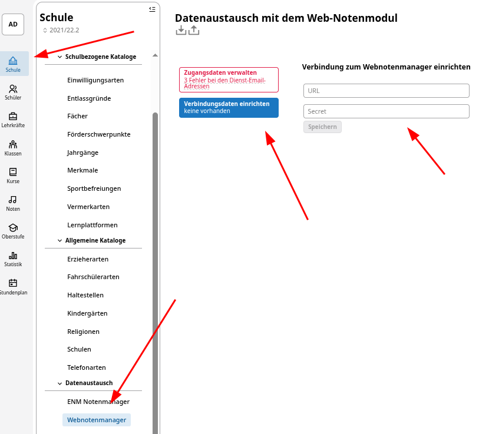

Nachdem die Verbindungsdaten erfolgreich eingegeben wurden, wird ein automatischer Verbindungstest durchgeführt. 

### Fehler bei der Einrichtung 

#### Abweichungen des internen Names
Möglicherweise ist die URL vom SVWS-Server aus nicht auffindbar. Dies könnte an den Proxyeinstellungen liegen. Hier könnte eine direkte Angabe der IP-Adresse statt des DNS-Namens erfolgen oder auch http:// statt https:// ausprobiert werden. 

Benutzung eines internen Zertifikats
In manchen, seltenen netzinternen Umgebungen kann die Frage auftreten, ob dem eigenen Zertifikat vertraut werden soll. Dies kann in Absprache mit dem technischen Admin durch Setzen des Hakens bestätigt werden. 

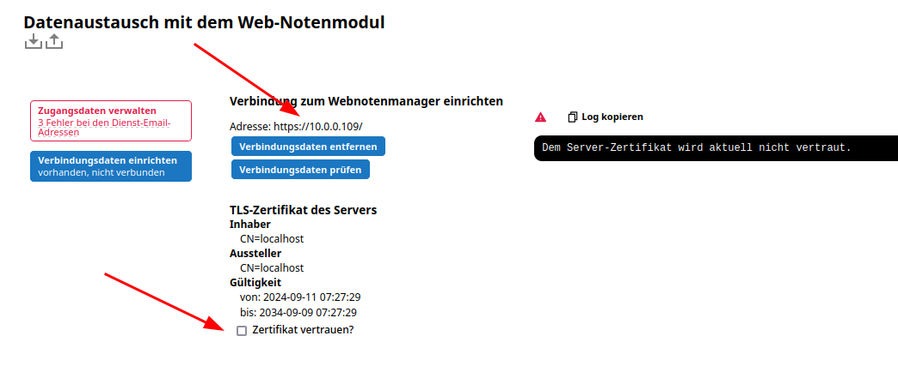

### Verbindung prüfen 

Sind die Zugangsdaten eingerichtet, kann die Verbindung jederzeit unter „Verbindungsdaten einrichten” geprüft werden. 

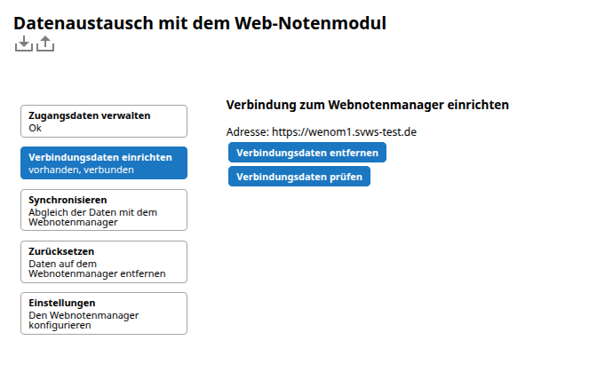

## Synchronisation

Nachdem die Verbindung zum Wenom-Server im SVWS-Server eingerichtet wurde, kann die schulfachliche Administration auf der oben genannten Konfigurationsoberfläche des SVWS-Servers die Synchronisation zwischen beiden Datenbeständen ausführen.

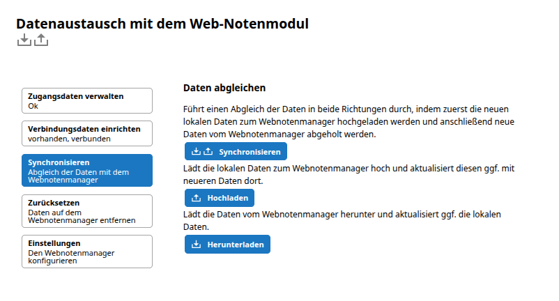

In besonderen Fällen kann nur hoch- bzw. runtergeladen werden. In der Regel werden die Datenbestände jedoch direkt synchronisiert, was einem Hochladen mit anschließendem Herunterladen entspricht. Dabei wird anhand eines Zeitstempels in beiden Datenbeständen entschieden, welcher Eintrag der neueste ist, und dieser wird dann jeweils übernommen. 

## Zurücksetzen / Daten löschen

Über den Punkt „Zurücksetzen” bietet sich der schulfachlichen Administration die Möglichkeit, 

+ Daten zurücksetzen
+ Daten und Benutzer zurücksetzen. 

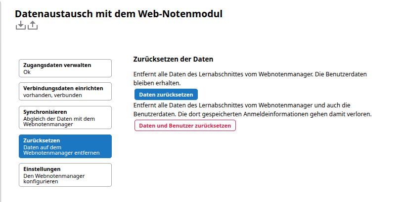

Im normalen halbjährlichen Schulabschnittswechsel können mit dem Punkt „Daten zurücksetzen” alte Zeugnisdaten zur Sicherheit noch einmal aus dem über das Internet erreichbaren System genommen werden, sodass das neue Halbjahr sauber begonnen werden kann. 

Falls ein Webnotenmanager aufgegeben werden soll und der schulfachliche Administrator somit die Löschung aller Daten auf dem Wenom-Server durchführen muss, kann dies über „Daten und Benutzer zurücksetzen” erreicht werden. 

### Verbindungsdaten löschen / erneuern
Wenn ein neues Secret benötigt wird oder ein Wenom-Server gelöscht werden soll, können die noch eingetragenen Zugangsdaten unter „Verbindungsdaten einrichten” gelöscht bzw. erneuert werden. 

::: danger Achtung!
Die Daten, die sich auf dem Wenom-Server befinden, werden dabei nicht gelöscht. Es wird nur die Verbindungsmöglichkeit gelöscht. (Diese kann ggf. auch wiederhergestellt werden, falls das Secret des Wenom-Servers noch gültig ist.) 
:::
 
## Zugänge der Lehrkräfte

Die Lehrkräfte erhalten von der schulfachlichen Administration ein Initialpasswort. In Kombination mit der Dienstmail sind dies die individuellen Zugangsdaten zum Webnotenmanager. 

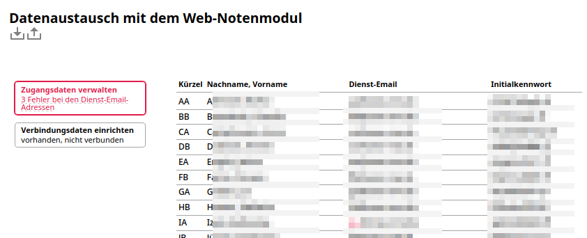

Ungültige oder uneindeutige E-Mail-Einträge in den Dienstmails werden als Fehler markiert und nicht zum Wenom-Server übertragen. Ebenso werden nur die Dienstmailadressen und keine privaten E-Mail-Adressen des Lehrerdatensatzes als Zugangsdaten verwendet.

Falls unter „Einstellungen” eine gültige E-Mail-Adresse zum Versenden von Nachrichten für den Wenom-Server eingetragen ist, können sich die Lehrkräfte statt des Initialpassworts ein neues Initialpasswort zuschicken lassen. 
(Diese Funktion ist in Version 1.0.12 noch nicht aktiviert.)

## Anmeldung einer Lehrkraft

Den **Lehrkräften** wird in der Schule ein Initialpasswort gegeben, das sie unter der URL ihres Wenom-Servers eingeben können. 

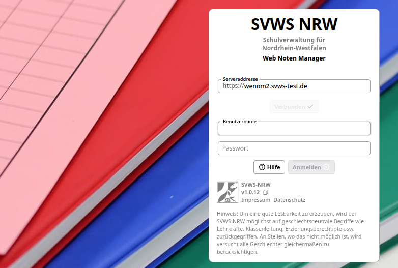

Nach dem Login öffnet sich in der Regel der Leistungsdatenreiter mit der vorausgewählten ersten Lerngruppe der Lehrkraft. 

Je nach Rolle der Lehrkraft kann die Ansicht variieren. Es wird zwischen den folgenden Möglichkeiten und den im Folgenden beschriebenen Geschäftsprozessen unterschieden:

+ Fachlehrkraft
+ Klassenleitung
- Schulleitung bzw. Abteilungsleitung

### Grundsätzliche Tabelleneinstellungen

In der Ansicht können Lerngruppen in die Tabellenübersicht aufgenommen bzw. abgewählt werden. Am rechten Rand der Tabelle können Spalten ein- und ausgeblendet werden. Je nach Benutzer können bis zu drei verschiedene Tabellen aufgerufen werden. 

+ Leistungsdaten
+ Teilleistungen
+ Klassenleitung

## Eintragungen der Fachlehrkraft

### Leistungsdaten

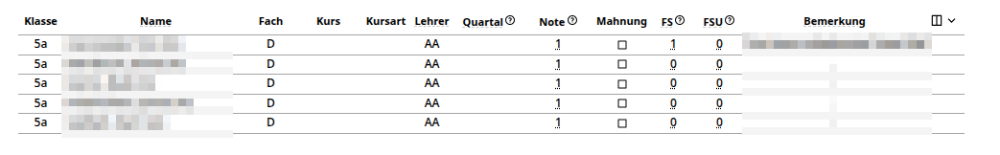

#### Noten eintragen

Die **Fachlehrkraft** kann die Noten für ihren eigenen Unterricht in den Leistungs- bzw. Teilleistungsdaten eingeben. Hierbei können ganze Noten (1, 2, 3, …) bzw. gebrochene Notenwerte (3+, 3, 3-, …) eingegeben werden. In den Leistungsdaten können die folgenden Notenarten spaltenweise eingegeben werden: 

+ Quartalsnoten
+ Note (als End- bzw. Zeugnisnote zu verstehen)

#### Mahnungen setzen

Unter den Leistungsdaten können Mahnungen neu gesetzt oder bereits ausgesprochene Mahnungen von der Lehrkraft nachgesehen werden. 

Ist die Checkbox mit einem Haken versehen und inaktiv, d. h. der Zustand der Checkbox kann nicht mehr verändert werden, so handelt es sich um eine ältere Mahnung, die dem Schüler z. B. im letzten Halbjahr durch die Vergabe eines Defizits ausgesprochen wurde. 

Mit dem entsprechenden Schüler ausgewählte Mahnungen sind am gesetzten Haken erkennbar und zusätzlich durch ihre rote Färbung. Diese können auch weiterhin von der Lehrkraft bearbeitet werden. Erst im Zuge der Weiterverarbeitung im SVWS-Server wird der Zustand einer versendeten bzw. ausgesprochenen Mahnung erreicht. Das bedeutet, dass die Checkbox erst nach der Verarbeitung im SVWS-Server und der erneuten Synchronisation mit dem Wenom-Server auf „angehakt” und „inaktiv” wechselt. Somit kann die Lehrkraft nachvollziehen, dass die Mahnung versendet bzw. ausgesprochen wurde. 

#### Fachbezogene Fehlstunden eintragen

Im Bereich „Fehlstunden” können fachbezogene Fehlstunden (FS) als ganze Zahl eingegeben werden. Die Anzahl der unentschuldigten Fehlstunden (FSU) wird in der benachbarten Spalte eingetragen. 

#### Eintragungen fachbezogene Bemerkungen

Durch Klicken auf „Fachbezogene Bemerkungen” öffnet sich ein modales Fenster. Es ist der zuvor ausgewählte Schüler ausgewählt, es können aber auch alle weiteren Schüler der entsprechenden Lehrgruppe auf der linken Seite ausgewählt werden. Im unteren Bereich können vorformulierte Floskeln entweder durch Eingabe des Kürzels oder durch Anklicken übernommen und beim Schüler eingetragen werden. 
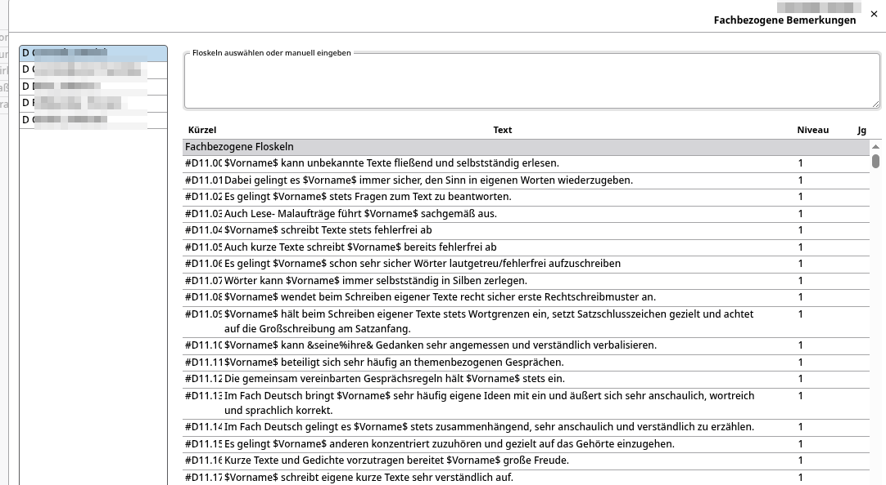

### Teilleistungen
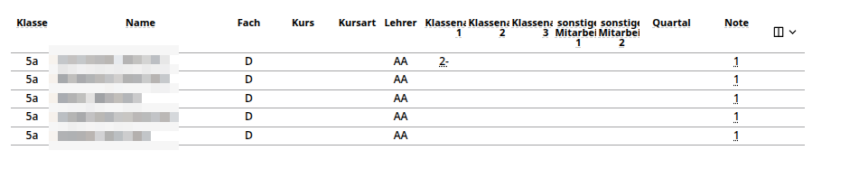

Als Teilleistungen werden die Zwischennoten, z. B. für Sonstige Mitarbeit, Klausuren und Klassenarbeiten, bezeichnet. Diese können je nach Schulform in ihrer Anzahl und in ihrer Bezeichnung variieren. Im Reiter „Teilleistungen” findet man eine Übersicht über alle in dieser Lerngruppe durch den zentralen SVWS-Server vorgegebenen Teilleistungsarten. 

Alternativ zum Leistungsdatenreiter können hier auch die Quartals- und Endnoten eingetragen werden. 

## Eintragungen der Klassenleitung

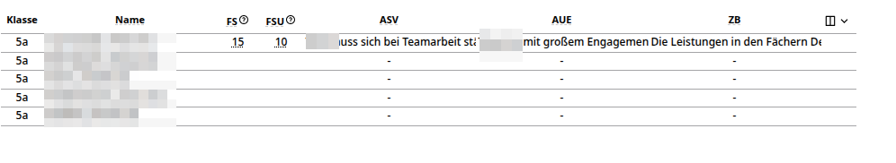

### FS und FSU
Der Reiter „Klassenleitung” ist nur für Klassenlehrkräfte sichtbar. Hier werden fachübergreifende Fehlstunden (FS und FSU), also die Gesamtfehlstunden, verwaltet, falls sich die Schule bzw. die Abteilung für eine direkte Erfassung der Gesamtnoten entschieden hat. 

### ASV, AUE und ZB

Unter den Spalten ASV (Arbeits- und Sozialverhalten), AUE (außerunterrichtliches Engagement) und ZB (Zeugnisbemerkung) können jeweils in diesen unterschiedlichen Kontexten Bemerkungen eingetragen werden. Ebenso wie bei den fachbezogenen Bemerkungen kann hier auf vorformulierte Floskeln zurückgegriffen werden. Zum Bearbeiten des Textes öffnet sich ein modales Fenster (siehe auch fachbezogene Bemerkungen).
 

## Tätigkeiten der Schulleitung/Abteilungsleitung

Die Schul- und Abteilungsleitung hat im Grunde die gleiche Ansicht wie eine Klassen- bzw. Fachlehrkraft. Es werden lediglich alle Lerngruppen der Schule bzw. der Abteilung zur Auswahl präsentiert.

Die Tätigkeiten beschränken sich hier stark auf das Sichten der Noten zu Beratungszwecken. Gegebenenfalls können Noten und Bemerkungen von erkrankten Lehrkräften eingesehen werden.

