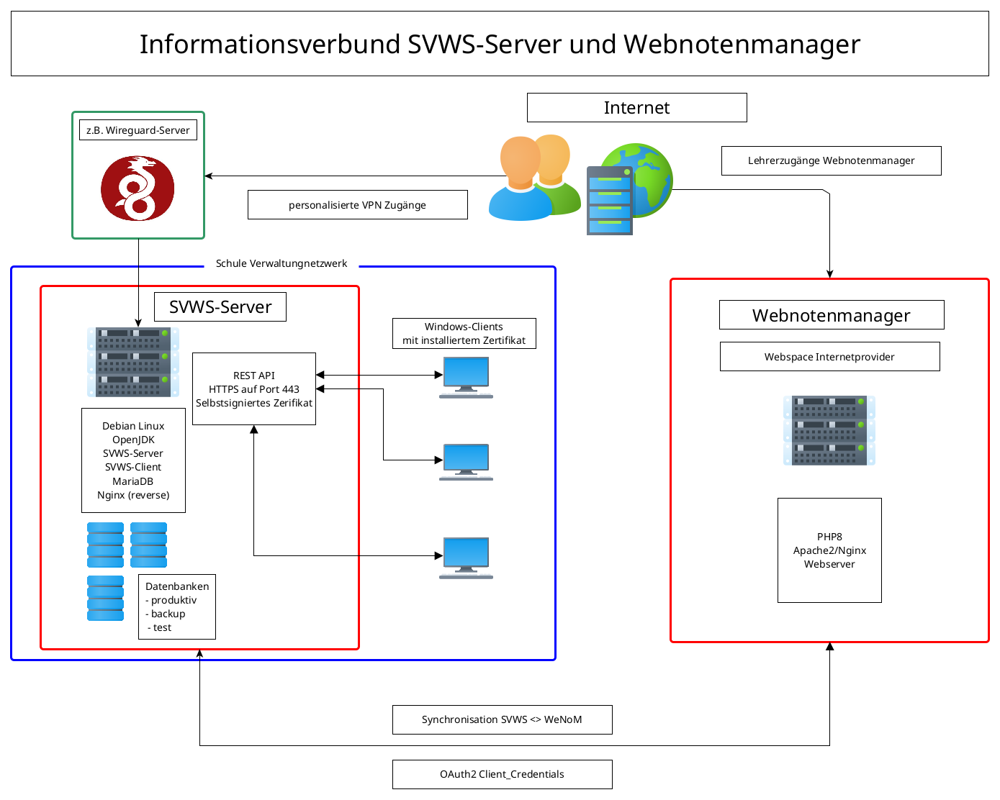

# WeNoM
**Installationsanleitung und technische Dokumentation**

Der Webnotenmanager **WeNoM** befindet sich derzeit in der Entwicklung (vgl.[Roadmap](../deployment/roadmap.md)) und wird Schulen die Eingabe von Leistungsdaten wie Noten von zu Hause aus ermöglichen.

[Benutzerhandbuch WeNoM](wenom_handbuch.md)

Der WeNoM wird auf PHP Basis mit Typescript und VUE.js entwickelt und wird eine benutzerfreundliche und intuitive Benutzeroberfläche bieten, um die Dateneingabe so einfach wie möglich zu gestalten. Die Software wird die eingegebenen Daten teilautomatisch mit dem SVWS-Server synchronisieren, um sicherzustellen, dass die Daten stets auf dem neuesten Stand sind und für interne Schulzwecke zur Verfügung stehen.




Die Datensynchronisation findet über den SVWS-Server statt. Hier werden das Client-Secret und die Verbindungsparameter zum Webserver eingetragen.
Es werden nun die schulspezifischen Einstellungen (Fehlstundenmodell, benötigte Daten usw.) zum Webnotenmangaer übermittelt. Zusätzlich werden für alle Lehrkräfte mit Klassen und Unterricht Verbindungsdaten und Unterrichte übermittelt.

Nach der Übermittlung können sich die Lehrkräfte im Webnotenmanager anmelden.

## Systemvoraussetzungen

Benötigt wird einfacher *Webspace mit PHP8* und den benötigten Extensions *php-fpm* und *php-sqlite3*.

Alternativ kann ein eigener Server mit einem *Apache2-Webserver* oder einem *nginx-Webserver* als Basis verwendet werden. Hier genügen geringe Anforderungen and die Hardware. 

bisher getestet: 
+ Debian 12, Apache2, php8.3, 4GB HDD, 2GB Ram, 1 Core
+ Debian 12, nginx, php8.2, 4GB HDD, 2GB Ram, 1 Core
+ Webhosting, Strato, php8.2
+ ...

weitere erfolgreiche Installationen bitte gerne melden.

Hier findet man ein vollständiges Skript zur [Einrichtung eines Testservers](./wenom_testinstall.md) auf Debian 12.  

Erläuterung der einzelnen Installationschritte: 

## Installation 

Grundlage: Apache2 auf Debian 12

Die in diesem Abschnitt beschriebenen, vorbereitenden Tätigkeiten werden beim Betrieb eines eigen Servers benötigt.

Beim Betrieb auf einem gehosteten Webspace kann direkt mit der [Installation der WeNoM Pakete](#Installation der WeNoM Pakete) begonnen werden. 

``` bash
apt update && apt upgrade -y
apt install apache2
systemctl status apache2.service 
apt install php php-fpm php-sqlite3 -y
a2enmod proxy_fcgi setenvif
a2enconf php8.2-fpm
a2enmod rewrite
systemctl reload apache2.service 
```

In der */etc/apache2/apache2.conf* ergänzen:

```bash
<Directory /var/www/html/>	
        Options Indexes FollowSymLinks
        AllowOverride All
        Require all granted
</Directory>
```
In der *etc/php/8.X/apache2/php.ini* die SQLite3-Extension durch entfernen des Semikolos aktivieren!

### PHP-Memory-Limit

In der */etc/php/8.X/apache2/php.ini* sollte der Wert ``` memory_limit=1024M ``` gesetzt werden.

Bitte Informieren Sie sich bei Ihrem Hoster, welches MemoryLimit aktiv ist.


## Installation der WeNoM Pakete

+ Entpacken aller Dateinen aus der *enmserver-x.x.x.zip* in das /html Verzeichnis des Webservers
+ Freigabe der Ordner app, db und public mit entsprechenden Rechten
+ Ändern des Documentroot im Apache in `/var/www/html/public` (siehe unten)

Die Ordnerstruktur in ```/var/www/html```  sollte nun folgerndermaßen aussehen:

``` bash
/app
/db
/public
```

Dabei muss das Documentroot in der `/etc/apache2/sites-available/000-default.conf` (ggf. auch `default-ssl.conf`) auf den Ordner `/var/www/html/public` zeigen!


## Ersteinrichtung


Zur ersten Initialisierung die folgende URL aufrufen: 

https://meinnotenmanager.de/api/setup

Über die Konsole des Browsers (F12) kann die Response überprüft werden.

Gültige Responsecodes:
204 Setup erfolgreich
409 Server ist schon initialisiert

Alternativ kann mit Tools wie Insomnia, Postman oder Bruno oder direkt curl gearbeitet werden.

+ Auth: keine Authentisierung
+ Headers ContentType application/x-www-form-urlencoded

Der zugehörige Curl-Befehl ist:

```bash
curl --request GET --url http://meinnotenmaganger/api/setup --header "Content-Type: application/x-www-form-urlencoded"
```

Der Aufruf des o.g. api Befehls erzeugt im Ordner /db eine app.sqlite Datenbank und eine Datei client.sec. In dieser Datei steht das generierte *Secret*.

Dieses *Secret* kann im SVWS-Client in der **App Schule** unter Datenaustausch ➜ Webnotenmanager zusammen mit der *URL* eingegeben werden und ermöglich so die Synchronisation mit dem SVWS-Server.

## Betrieb mit mehreren Mandanten

Falls nur ein Server für mehrere Schulen bereitgestellt werden soll, so kann dies mit Hilfe von "virtual Hosts" im Apache bereitgestellt werden. 
Es wird somit unter einer technischen Plattform mehrere Webnotenmanager für unterschiedliche Schulen in voneinander getrennten Bereichen bzw. mit verschiedenen Zugängen ihren jeweiligen Webnotenmanager betrieben werden können. (Alternativ kann dieses Ziel natürlich auch mit Docker erreicht werden.)

Unter ``` /etc/apache2/sites-available/``` kann hierfür eine neue .conf Datei angelegt werden, so dass hier ein Trennung der Konfiguration Mandanten durch einzelne Dateien ermöglicht wird. In dieser Konfiguration kann der Speicherort der Datenbank mit der Umgebungsvariablen ```SetEnv ENM_DB_DIR Path_to_dir``` gesetzt werden. Diese Variable wird von der Wenominstallation ausgelesen und bestimmt damit je nach Servername, der in dieser virtual Host konfiguration angegeben ist, einen unterschiedlichen Speicherort von Sqlite Datenbank und Credentials. 

### Beispielkonfiguration

In dem folgenden Beispiel soll nun für "Schule1" ein separater Zugang zu eines separaten Datenbank inkl. Secret Credentials geschaffen werden: 

+ Separaten Speicherort für "Schule1" unter dem Ordener ```db``` der Wenom Installation anlegen. z.B: 

```bash 
mkdir /var/www/html/db/schule1
```

+ Virtual Host unter ```/etc/apache2/sites-available/schule1.conf``` anlegen

```bash 
echo "
<VirtualHost *:443>
        ServerAdmin webmaster@localhost
        ServerName schule1.your_domain.de

        DocumentRoot /var/www/html/public

        ErrorLog ${APACHE_LOG_DIR}/error.log
        CustomLog ${APACHE_LOG_DIR}/access.log combined

        SSLEngine on

        SSLCertificateFile      /etc/ssl/certs/ssl-cert-snakeoil.pem
        SSLCertificateKeyFile   /etc/ssl/private/ssl-cert-snakeoil.key

        <FilesMatch "\.(?:cgi|shtml|phtml|php)$">
                SSLOptions +StdEnvVars
        </FilesMatch>
        <Directory /usr/lib/cgi-bin>
                SSLOptions +StdEnvVars
        </Directory>

        SetEnv ENM_DB_DIR db/schule1

</VirtualHost>

" >> /etc/apache2/sites-available/schule1.conf

```

Hierbei ist zu beachten, dass ```schule1.your_domain.de```, ```SetEnv ENM_DB_DIR db/schule1``` und ```/etc/apache2/sites-available/schule1.conf``` entsprechend der vorhanden Domain (your_domain.de) und dem von Ihnen gewählten Schulnamen (schule1) angepasst werden. 

+ verlinken apache2 neu starten 

```bash 
ln -s /etc/apache2/sites-available/schule1.conf /etc/apache2/sites-enabled/schule1.conf
systemctl restart apache2
```

## Reverse Proxy Einstellungen

Beim Betrieb hinter einem Reverse Proxy muss darauf geachtet werden, dass die header Information korrekt durchgereicht wird. In oben genanntem Beispiel sind die folgenden Einstellungen in ```/etc/nginx/sites-available/schule1.conf``` zu ergänzen: 

```bash 
    add_header 'Content-Security-Policy' 'upgrade-insecure-requests';
    proxy_set_header X-Content-Type-Options nosniff;
    proxy_set_header X-Frame-Options "SAMEORIGIN";
    proxy_set_header Host $host;
    proxy_set_header X-Real-IP $remote_addr;
    proxy_set_header X-Forwarded-For $proxy_add_x_forwarded_for;

    proxy_http_version 1.1;
    proxy_read_timeout 300;
    proxy_connect_timeout 300;
    proxy_send_timeout 300;
```


